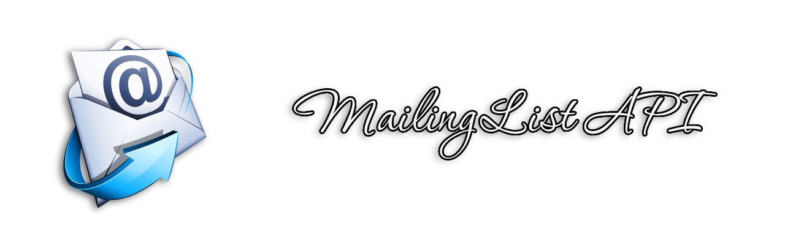

> An open source mailing list API developed with Node.js and TypeScript, using Clean Architecture.

<!-- Badges -->

---

- [Techs](#techs)
- [Dependencies](#dependencies)
- [Run](#run)
- [Requirements](#requirements)
- [Pratices](#pratices)
- [Credits](#credits)
- [References](#references)
- [License](#license)

---

## Techs

- Node.js - v18.7.0
- TypeScript
- Express
- Docker
- Jest
- TS Jest
- Eslint
- EditorConfig
- Lint Staged
- Commitlint
- Husky
- RimRaf
- Module Alias

## Dependencies

To run the project, you just need to install [Docker](https://docs.docker.com/engine/install/). After installing, see the instructions in the [Run](#run) topic.

## Run

...

## Requirements

- Functional
  - Register User on Mailing List
  - Send email to User with bonus

## Pratices

- **Principles**
  - Small Commits
  - Single Responsibility Principle (SRP)
  - Open Closed Principle (OCP)
  - Liskov Substitution Principle (LSP)
  - Interface Segregation Principle (ISP)
  - Dependency Inversion Principle (DIP)
  - Separation of Concerns (SOC)
  - Don't Repeat Yourself (DRY)
  - You Aren't Gonna Need It (YAGNI)
  - Keep It Simple, Silly (KISS)
  - Composition Over Inheritance
- **Design Patterns**
  - Factory
  - Dependency Injection
  - Adapter
- **Methodologies and Design**
  - Clean Architecture
  - Test-Driven Development (TDD)
  - Domain-Driven Design (DDD)
  - Conventional Commits
  - Dependency Diagrams
  - Use Cases
  - Continuous Integration
  - Continuous Delivery
  - Continuous Deployment
  - Value Objects
  - In Memory Test Database

## Credits

- Otávio Lemos - Arquitetura Limpa na Prática (Book and Course)

## References

- Clean Architecture - Robert Martin (Book)

## License

This project is covered by the MIT license. For more information, read the [LICENSE](./LICENSE) file.

Copyright &copy; 2022 Maurício Romagnoli.
